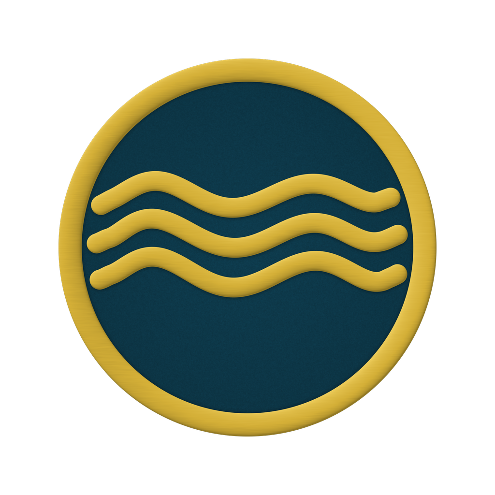

<!-- markdownlint-disable MD001 MD013 MD033 MD041 MD060 -->

<div align="center">



# Anclora Private Estates Landing

### Öffentliche Landingpage zur Lead-Erfassung für Anclora Private Estates

Öffentliche, ausschließlich dunkle Landingpage mit vollständiger Identität von `anclora-private-estates`, ausgerichtet auf hochwertige Lead-Erfassung.

[Español](./README.md) · [Català](./README.ca.md) · **Deutsch** · [English](./README.en.md) · [Svenska](./README.sv.md) · [Français](./README.fr.md) · [Italiano](./README.it.md) · [Dansk](./README.da.md) · [Nederlands](./README.nl.md) · [Norsk](./README.no.md) · [Português](./README.pt.md)

<br />


</div>

---

> [!IMPORTANT]
> Reduziertes öffentliches Repository. Es beschreibt das Produkt und seine konzeptionelle Architektur, ohne operative Logik, Geheimnisse oder reale Daten offenzulegen.

## Was es ist

Anclora Private Estates Landing ist die öffentliche Landingpage zur Lead-Erfassung der Marke Private Estates. Sie läuft ausschließlich im Dunkelmodus (kein Theme-Umschalter, eine bewusste Entscheidung) mit einem Umschalter für 11 Sprachen, was die visuelle Signatur der Luxusmarke stärkt.

## Kategorie im Ökosystem

| Feld | Wert |
|---|---|
| Kategorie | Ultra Premium (öffentliche Landingpage) |
| Markenakzent | `#D4AF37` |
| Typografie | Cardo + Inter + Fraunces |
| Kanonisches Repository | `anclora-private-estates-landing` |

## Kernfunktionen

- Ausschließlich dunkle Landingpage mit vollständiger Private-Estates-Identität
- Umschalter für 11 Sprachen (kein Theme-Umschalter, per Design)
- Hochwertige Lead-Erfassung

## Technologie-Stack

| Bereich | Technologie |
|---|---|
| Frontend | React, TypeScript |
| Styling | Tailwind CSS |
| Tests | Vitest |

## Lokaler Start

```bash
npm install
npm run dev
```

## Unterstützte Sprachen

Das Produkt unterstützt in der Produktion 11 Sprachen: Español (Standard), Català, Deutsch, English, Svenska, Français, Italiano, Dansk, Nederlands, Norsk, Português (`ULTRA_PREMIUM_LOCALES`, `src/lib/anclora-language-toggle.ts`).

Diese Dokumentation wird in allen 11 Produktsprachen gepflegt.

## Dokumentation und Governance

- Marken- und Governance-Verträge: [`docs/standards/`](./docs/standards/)
- Anclora Vault (Quelle der Wahrheit): `contracts/` und `docs/governance/`

---

<div align="center">

### Anclora Group

</div>
